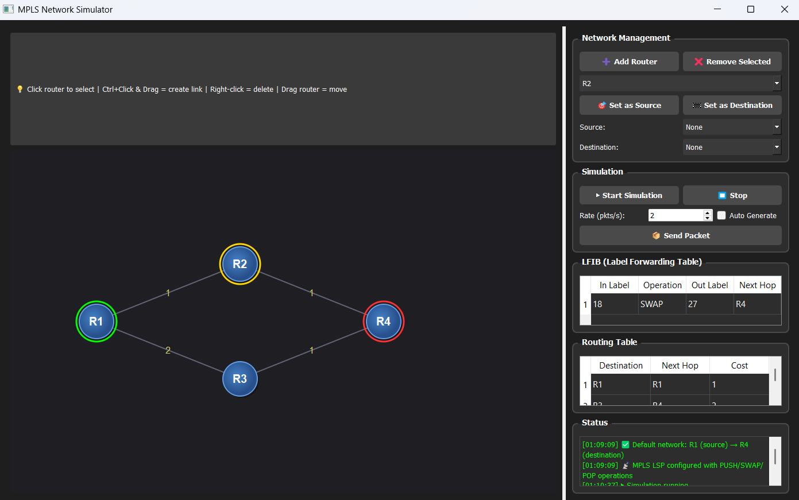

# 🌐 MPLS Network Simulator

**Visualization of MPLS (Multi-Protocol Label Switching) showing real-time packet flow using PUSH, SWAP, and POP operations.**

---

## 📡 What this Simulation Demonstrates

This project simulates how **MPLS replaces traditional IP routing** with **label-based forwarding**.

Instead of checking long IP addresses at every hop, routers use **short labels** to forward packets efficiently.

---

## ⚡ Core MPLS Concept

### Traditional Routing Problem
- Every router checks full IP address
- Complex routing table lookup
- Slower processing at each hop

### MPLS Solution
- Packet gets a **label (integer)**
- Routers use **LFIB (Label Forwarding Table)**
- Fast lookup → faster forwarding

---

## 🔄 Three Key MPLS Operations (Visualized)

| Operation | Where it happens | What it does | In Simulation |
|----------|----------------|-------------|--------------|
| **PUSH** | Ingress Router | Adds label to packet | 🟢 Packet turns Green |
| **SWAP** | Transit Router | Replaces label | 🟡 Packet turns Yellow |
| **POP** | Egress Router | Removes label | 🔴 Packet turns Red |

---

## 🧠 What Happens in the Simulation

### 1. Network Topology Creation
- Routers are connected as a graph
- Each link has a cost
- Shortest path is computed using **Dijkstra’s Algorithm**

---

### 2. LSP (Label Switched Path) Formation

A path is created from **Source → Destination**

Example:

R1 → R2 → R4

Then labels are assigned:

- Destination allocates label
- Labels propagate backward
- Each router builds its **LFIB**

---

### 3. LFIB Table Creation

Each router stores:

Incoming Label → Operation → Outgoing Label → Next Hop

Example:

| Router | Entry |
|--------|------|
| R1 | PUSH → 24 → R2 |
| R2 | 24 → SWAP → 27 → R4 |
| R4 | 27 → POP |

---

### 4. Packet Flow (Main Simulation)

#### Step-by-step:

**At Source (Ingress Router)**
- Packet has NO label
- PUSH operation adds label
- Packet becomes **Green**

[DATA] → [LABEL 24 | DATA]

---

**At Transit Router**
- Label is replaced (SWAP)
- Packet becomes **Yellow**

[24] → [27]

---

**At Destination (Egress Router)**
- Label is removed (POP)
- Packet becomes **Red**

[27] → [DATA]

---

## 🎯 Key Observations from Simulation

- ✔️ Packet path is **pre-determined (LSP)**
- ✔️ No routing decisions during forwarding
- ✔️ Each router performs **simple label lookup**
- ✔️ Operations are visually distinguishable (Green → Yellow → Red)
- ✔️ Faster than traditional routing (conceptually)

---

## 📊 Why MPLS is Efficient

| Feature | Benefit |
|--------|--------|
| Label-based forwarding | Faster lookup |
| Precomputed path (LSP) | No runtime routing decisions |
| Simple operations | Reduced CPU usage |
| Deterministic routing | Predictable traffic flow |

---

## 🔍 What You Learn from This Project

- How MPLS replaces IP routing logic
- How labels are assigned and propagated
- How LFIB tables work internally
- Difference between **Ingress, Transit, Egress routers**
- Real-time visualization of packet transformation

---

## 🧩 Summary

This simulation clearly shows:

> **MPLS = Precomputed path + Label switching + Fast forwarding**

Instead of:

IP → Lookup → Forward (every hop)

We get:

Label → Swap → Forward (constant time)

---

## 🚀 Output Snapshot

The image above (`image.png`) represents:
- Network topology
- Active LSP path
- Moving packets
- Color-coded MPLS operations

---
